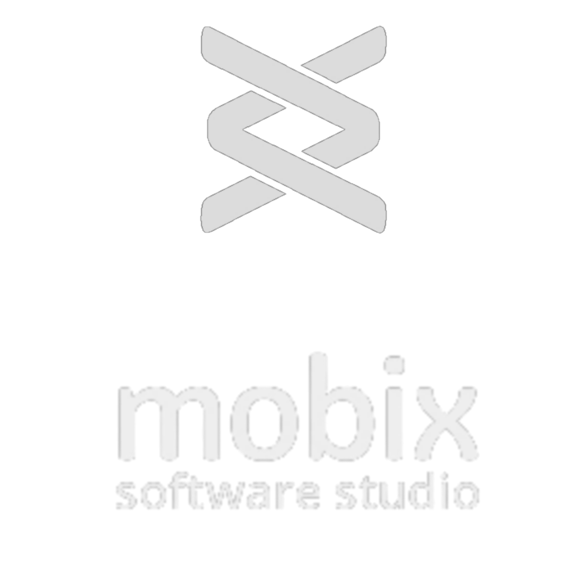

<br />
<p align="center">
  <a href="https://www.mobixtec.com">
    
  </a>
  <h2 align="center">
    <strong>
      Challenge Mobix
    </strong>
  </h2>

  <p align="center">
    This project aims to implement the technical challenge for the selection process of the <a href="https://www.mobixtec.com">Mobix Software Studio</a>.
  </p>
</p>

<p align="center"></p>

<details open="open">
  <summary>
    <strong>
      Summary
    </strong>
  </summary>
  <ol>
    <li>
      <a href="#-about-the-project">About the project</a>
      <ul>
        <li><a href="#-main-points">Main points</a></li>
      </ul>
      <ul>
        <li><a href="#-framework">Framework</a></li>
      </ul>
    </li>
    <li><a href="#-installation">Installation</a></li>
  </ol>
</details>

# 💭 **About the project**

The challenge aims to evaluate the experiences:

- Layout creation
- Patterns using React Native
- Good programming practices and project organization

An app that simulates a Pokedex must be created.

## ❗ **Main points**

- An [API](https://pokeapi.co/docs/v2#pokemon-section) was made available for consumption in the application.
- A [prototype of the system](https://www.figma.com/file/943D2Dx1H3uEVBMast3hzt/Teste-Pokemon?node-id=0%3A1) was developed which was followed in the development of the application
- React Native CLI was used.
- Implemented login functionality and keeps the user logged into the app after login.
- Infinite scroll.

## ✨ **Framework**

- <a href="https://reactnative.dev"></a>
- <a href="https://www.npmjs.com/package/react-native-cli"></a>
- <a href="https://reactnativepaper.com"></a>
- <a href="https://reactnavigation.org"></a>

- <a href="https://styled-components.com"></a>

- <a href="https://redux.js.org"></a>
- <a href="https://redux-toolkit.js.org"></a>

- <a href="https://www.typescriptlang.org"></a>

- <a href="https://yarnpkg.com"></a>

- <a href="https://git-scm.com"></a>
- <a href="https://github.com"></a>

# 📲 **Installation**

- Clone the repository with the command
  ```sh
  git clone https://github.com/LinsThi/desafio-mobix.git
  ```
- To install all the dependencies used in the project, just run the command `yarn`.
- The application can be started with `npx react-native run-android`.
- You need to run the application on an emulator or on your cell phone.
- Credentials to access the application:

  | Available Emails |
  | :--------------: |
  |  adm@gmail.com   |
  | thiago@gmail.com |

  Default password: 123456

---
